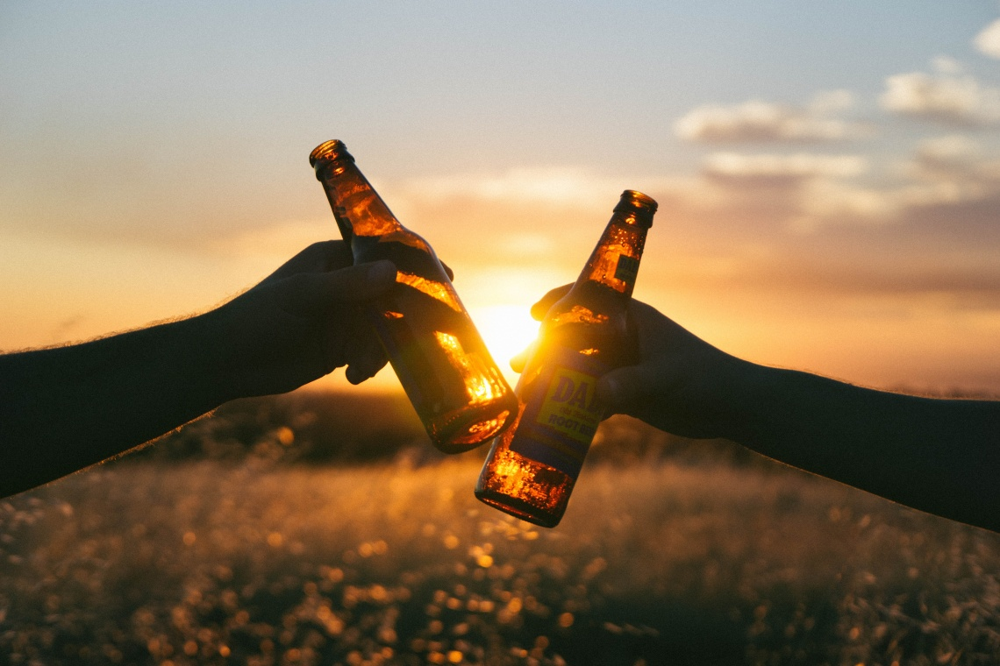

#### Overview

This is a preliminary, strictly for-fun foray into beer data. Pairs well with most session IPAs.

All beer data was grabbed from the [BreweryDB API](http://www.brewerydb.com/developers), converted from JSON into a dataframe, and dumped into a MySQL database. You can find the **main report in [`compile/compile.md`](https://github.com/aedobbyn/beer-data-science/blob/master/compile/compile.md)** and a presentation given at RLadies Chicago in a couple formats in the [`present`](https://github.com/aedobbyn/beer-data-science/blob/master/present) directory. 

The overarching question I went into the analysis with was: how well do beer styles actually describe the characteristics of beers within each style? In other words, do natural clusters in beer align well with style boundaries?

I set about answering this with a mix of clustering (k-means) and classification (neural net and random forest) methods. If you want to play around with clustering interactively, there's an [app](https://amandadobbyn.shinyapps.io/clusterfun/) for that.

#### Structure
- Markdown report in [`/compile`](https://github.com/aedobbyn/beer-data-science/blob/master//compile/compile.md)
- [Presentation](https://aedobbyn.github.io/beer-data-science/#/) given at RLadies Oktoberfest meetup 
    - .Rpres code in [`/present`](https://github.com/aedobbyn/beer-data-science/blob/master/present)
- [Shiny app](https://amandadobbyn.shinyapps.io/clusterfun/) code in [`/clusterfun`](https://github.com/aedobbyn/beer-data-science/blob/master/clusterfun)
- Step-by-step scripts for getting and munging data in [`/run_it`](https://github.com/aedobbyn/beer-data-science/blob/master/run_it)

#### Reproduce it

To grab the data yourself, you can create an API key on BreweryDB run the `run_it.R` script inside the `run_it` directory. For a quicker but less up-to-date solution (the BreweryDB database is updated pretty frequently) you might consider stashing the data in a CSV or .feather file.

This analysis deals mainly with beer and its consituent components like ingredients (hops, malts) and other characteristics like bitterness and alcohol content. However, you can easily construct your own function for grabbing other things like breweries, glassware, locations, etc. by running the function generator in `helpers/construct_funcs.R`.

Any and all feedback is more than welcome. Cheers!
 
