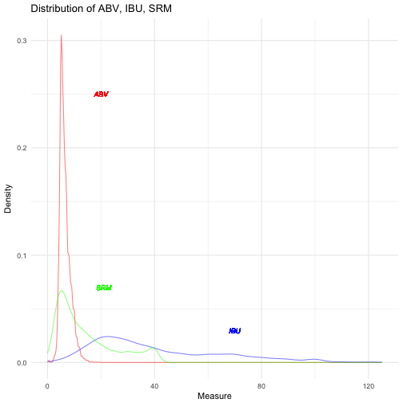

Beer-in-Hand Data Science
========================================================
author: Amanda Dobbyn
date: 
autosize: true
transition: zoom


Where's the code at
========================================================
Code at: <https://github.com/aedobbyn/beer-data-science>


The Order of Things, theoretically
========================================================

<br>


***

<br>


#### Are beer styles just a social construct?


The beer landscape
========================================================
Looks a bit messier than it should




Step 1: GET Beer
========================================================


***


Step 1: GET Beer
========================================================


```r
base_url <- "http://api.brewerydb.com/v2"
key_preface <- "/?key="

paginated_request <- function(ep, addition, trace_progress = TRUE) {    
  full_request <- NULL
  first_page <- fromJSON(paste0(base_url, "/", ep, "/", key_preface, key
                                , "&p=1"))
  number_of_pages <- ifelse(!(is.null(first_page$numberOfPages)), 
                            first_page$numberOfPages, 1)      

    for (page in 1:number_of_pages) {                               
    this_request <- fromJSON(paste0(base_url, "/", ep, "/", key_preface, key
                                    , "&p=", page, addition),
                             flatten = TRUE) 
    this_req_unnested <- unnest_it(this_request)    #  <- request unnested here
    
    if(trace_progress == TRUE) {message(paste0("Page ", this_req_unnested$currentPage))} # if TRUE, print the page we're on
    
    full_request <- bind_rows(full_request, this_req_unnested[["data"]])
  }
  return(full_request)
} 

all_beer_raw <- paginated_request("beers", "&withIngredients=Y")
```


What have we got?
========================================================

<br> 

* ABV: alcohol by volume
* IBU: International Biterness Units (really)
* SRM: a measure of color
    
***


Step 2: Breathe sigh of relief, Collapse
========================================================


```r
keywords <- c("Lager", "Pale Ale", "India Pale Ale", "Double India Pale Ale", "India Pale Lager", "Hefeweizen", "Barrel-Aged","Wheat", "Pilsner", "Pilsener", "Amber", "Golden", "Blonde", "Brown", "Black", "Stout", "Imperial Stout", "Fruit", "Porter", "Red", "Sour", "Kölsch", "Tripel", "Bitter", "Saison", "Strong Ale", "Barley Wine", "Dubbel")

keyword_df <- as_tibble(list(`Main Styles` = keywords))
```


```r
collapse_styles <- function(df, trace_progress = TRUE) {
  
  df[["style_collapsed"]] <- vector(length = nrow(df))
  
  for (beer in 1:nrow(df)) {
    if (grepl(paste(keywords, collapse="|"), df$style[beer])) {    
      for (keyword in keywords) {         
        if(grepl(keyword, df$style[beer]) == TRUE) {
          df$style_collapsed[beer] <- keyword    
        }                         
      } 
    } else {
      df$style_collapsed[beer] <- as.character(df$style[beer])       
    }
    if(trace_progress == TRUE) {message(paste0("Collapsing this ", df$style[beer], " to: ", df$style_collapsed[beer]))}
  }
  return(df)
}
```

Collapse
========================================================


Which styles reign supreme?
========================================================


```r
# Pare down to only cases where style is not NA
beer_dat_pared <- beer_necessities[complete.cases(beer_necessities$style), ]

# Arrange by style popularity
style_popularity <- beer_dat_pared %>% 
  group_by(style) %>% 
  count() %>% 
  arrange(desc(n))

# Add a column that z-scores popularity
style_popularity <- bind_cols(style_popularity, 
                               n_scaled = as.vector(scale(style_popularity$n)))

# Find styles that are above a z-score of 0 (the mean)
popular_styles <- style_popularity %>% 
  filter(n_scaled > 0)

# Pare dat down to only beers that fall into those styles, so styles that are above mean popularity
popular_beer_dat <- beer_dat_pared %>% 
  filter(
    style %in% popular_styles$style
  ) %>% 
  droplevels() %>% 
  as_tibble() 
```

* Style "centers" I defined as the mean ABV, IBU, and SRM of each style


Clustering
========================================================

* If styles truly define distinct pockets of beer, some of that should be represented in unsupervised clustering


```r
prep_clusters <- function(df, preds, to_scale, resp) {
  df_for_clustering <- df %>%
    select_(.dots = c(response_vars, cluster_on)) %>%
    na.omit() %>%
    filter(
      abv < 20 & abv > 3    # Only keep beers with ABV between 3 and 20 and an IBU less than 200
    ) %>%
    filter(
      ibu < 200    
    )
  
  df_all_preds <- df_for_clustering %>%
    select_(.dots = preds)
  
  df_preds_scale <- df_all_preds %>%
    select_(.dots = to_scale) %>%
    rename(
      abv_scaled = abv,
      ibu_scaled = ibu,
      srm_scaled = srm
    ) %>%
    scale() %>%
    as_tibble()
  
  df_preds <- bind_cols(df_preds_scale, df_all_preds[, (!names(df_all_preds) %in% to_scale)])
  
  df_outcome <- df_for_clustering %>%
    select_(.dots = resp) %>%
    na.omit()
  
  cluster_prep_out <- list(df_for_clustering = df_for_clustering, preds = df_preds, outcome = df_outcome)
  
  return(cluster_prep_out)
}
```


```r
cluster_on <- c("abv", "ibu", "srm", "total_hops", "total_malt")
to_scale <- c("abv", "ibu", "srm", "total_hops", "total_malt")
response_vars <- c("name", "style", "style_collapsed")

cluster_prep <- prep_clusters(df = beer_dat,
                   preds = cluster_on,
                   to_scale = to_scale,
                   resp = response_vars)
```


```r
cluster_it <- function(df_preds, n_centers) {
  set.seed(9)
  clustered_df_out <- kmeans(x = df_preds$preds, centers = n_centers, trace = FALSE)

  clustered_df <- as_tibble(data.frame(
    cluster_assignment = factor(clustered_df_out$cluster),
    df_preds$outcome, df_preds$preds,
    df_preds$df_for_clustering %>% select(abv, ibu, srm)))

  return(clustered_df)
}
```


```r
clustered_beer <- cluster_it(df_preds = cluster_prep, n_centers = 10)
```


Clusterfun with Shiny
========================================================


```r
  output$cluster_plot <- renderPlot({
  
    # If our checkbox is checked saying we do want style centers, show them. Else, don't.
    if (input$show_centers == TRUE & input$show_all == FALSE) {
      
      this_style_center <- reactive({style_centers %>% filter(style_collapsed == input$style_collapsed)})
      
      ggplot() +
        geom_point(data = this_style_data(),
                   aes(x = abv, y = ibu, colour = cluster_assignment), alpha = 0.5) +
        geom_point(data = this_style_center(),
                   aes(mean_abv, mean_ibu), colour = "black") +
        geom_text_repel(data = this_style_center(),
                        aes(mean_abv, mean_ibu, label = input$style_collapsed),
                        box.padding = unit(0.45, "lines"),
                        family = "Calibri") +
        ggtitle("k-Means Clustered Beer") +
        labs(x = "ABV", y = "IBU") +
        labs(colour = "Cluster Assignment") +
        theme_minimal() +
        theme(legend.position="none")
    } else if ... etc., etc.
```


Clusterfun with Shiny
========================================================

<https://amandadobbyn.shinyapps.io/clusterfun/>


Narrowing In
========================================================


