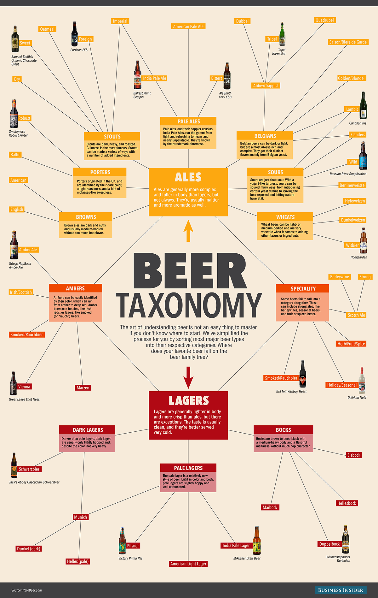
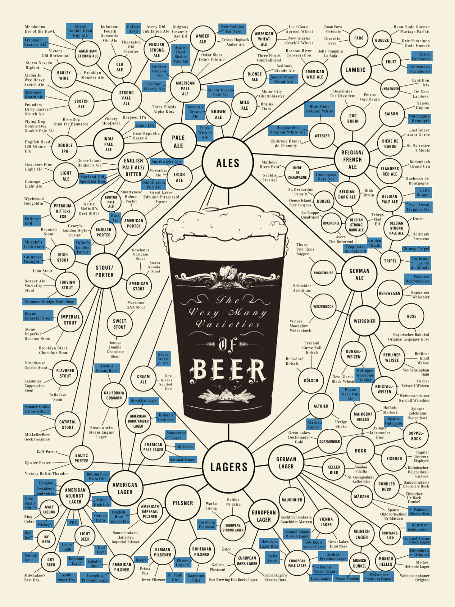
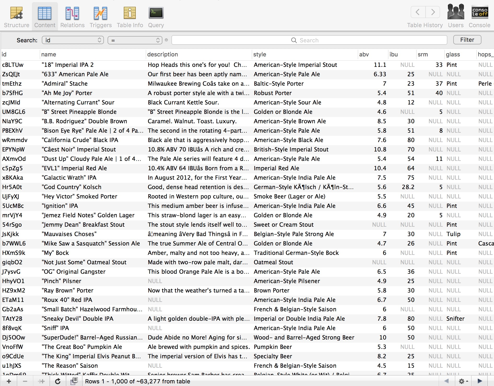
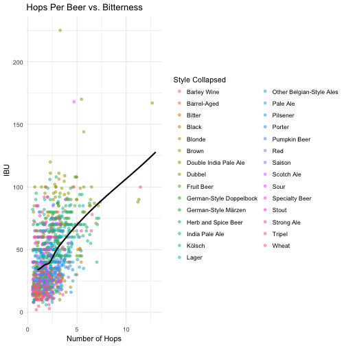

Beer-in-Hand Data Science
========================================================
author: Amanda Dobbyn
date: 
autosize: true

<style>
  td{
    <!-- font-family: Arial;  -->
    font-size: 4pt;
    padding:0px;
    cellpadding="0";
    cellspacing="0"
  }
  th {
    <!-- font-family: Arial;  -->
    font-size: 4pt;
    height: 20px;
    font-weight: bold;
    text-align: right;
    background-color: #989da5;
  }
  table { 
    border-spacing: 0px;
    border-collapse: collapse;
  }
  
  .small-code pre code {
    font-size: 1em;
  }
</style>


First things first
========================================================
Who am I?
UChicago '15, go whatever our mascot is
[Earlybird Software](http://earlybird.co/)

Where's the code at?
Code at: <https://github.com/aedobbyn/beer-data-science>


The Order of Things, theoretically
========================================================

<br>



***

<br>



#### Are beer styles just a social construct?


Implications
========================================================

* If styles do demarcate the beer landscape well, we should expect to see distinct clusters dominated mostly by beers classified into a *single* style.

* It should also be easy to predict style from the other variables

This all, assuming the features we have can account for most of the variance between styles


<br> 

**The stakes could not be higher**.


Step 1: GET Beer
========================================================

From where?
[BreweryDB](http://www.brewerydb.com/developers/docs).


***


Step 1: GET Beer
========================================================
class: small-code


```r
base_url <- "http://api.brewerydb.com/v2"
key_preface <- "/?key="

paginated_request <- function(ep, addition, trace_progress = TRUE) {    
  full_request <- NULL
  first_page <- fromJSON(paste0(base_url, "/", ep, "/", key_preface, key
                                , "&p=1"))
  number_of_pages <- ifelse(!(is.null(first_page$numberOfPages)), 
                            first_page$numberOfPages, 1)      

    for (page in 1:number_of_pages) {                               
    this_request <- fromJSON(paste0(base_url, "/", ep, "/", key_preface, key
                                    , "&p=", page, addition),
                             flatten = TRUE) 
    this_req_unnested <- unnest_it(this_request)    #  <- request unnested here
    
    if(trace_progress == TRUE) {message(paste0("Page ", this_req_unnested$currentPage))} # if TRUE, print the page we're on
    
    full_request <- bind_rows(full_request, this_req_unnested[["data"]])
  }
  return(full_request)
} 

all_beer_raw <- paginated_request("beers", "&withIngredients=Y")
```


What have we got?
========================================================
<br> 

* 63,495 distinct beers

<br> 

* ABV: alcohol by volume
* IBU: International Biterness Units (really)
* SRM: [a measure of color](http://www.twobeerdudes.com/beer/srm)
* Ingredients
    * Hops, malts

<br> 
**What have we *not* got?**
Flavor profiles (fruity, hoppy, piney); ratings
    
***


Where did we put it?
========================================================

MySQL. 



* This allows us to
   * Easily update the data if anything changes
   * Others easy access to the data if they want to build an app using it


Step 2: Breathe sigh of relief, Collapse
========================================================
class: small-code


```r
keywords <- c("Lager", "Pale Ale", "India Pale Ale", "Double India Pale Ale", "India Pale Lager", "Hefeweizen", "Barrel-Aged","Wheat", "Pilsner", "Pilsener", "Amber", "Golden", "Blonde", "Brown", "Black", "Stout", "Imperial Stout", "Fruit", "Porter", "Red", "Sour", "Kölsch", "Tripel", "Bitter", "Saison", "Strong Ale", "Barley Wine", "Dubbel")

keyword_df <- as_tibble(list(`Main Styles` = keywords))
```


```r
collapse_styles <- function(df, trace_progress = TRUE) {
  
  df[["style_collapsed"]] <- vector(length = nrow(df))
  
  for (beer in 1:nrow(df)) {
    if (grepl(paste(keywords, collapse="|"), df$style[beer])) {    
      for (keyword in keywords) {         
        if(grepl(keyword, df$style[beer]) == TRUE) {
          df$style_collapsed[beer] <- keyword    
        }                         
      } 
    } else {
      df$style_collapsed[beer] <- as.character(df$style[beer])       
    }
    if(trace_progress == TRUE) {message(paste0("Collapsing this ", df$style[beer], " to: ", df$style_collapsed[beer]))}
  }
  return(df)
}
```

Collapse
========================================================


Popular Styles
========================================================

* Pare down to only the popular kids
   * Those with above the mean number of beers in their style (z-score > 0)
* And then get a sense of where those styles fall in relation to one another
    * Style "centers" = mean ABV, IBU, and SRM of each style


Popular Styles
========================================================
class: small-code

<table>
 <thead>
  <tr>
   <th style="text-align:left;"> Collapsed Style </th>
   <th style="text-align:right;"> Mean ABV </th>
   <th style="text-align:right;"> Mean IBU </th>
   <th style="text-align:right;"> Mean SRM </th>
   <th style="text-align:right;"> Numer of Beers </th>
  </tr>
 </thead>
<tbody>
  <tr>
   <td style="text-align:left;"> India Pale Ale </td>
   <td style="text-align:right;"> 6.58 </td>
   <td style="text-align:right;"> 66.04 </td>
   <td style="text-align:right;"> 9.99 </td>
   <td style="text-align:right;"> 6524 </td>
  </tr>
  <tr>
   <td style="text-align:left;"> Pale Ale </td>
   <td style="text-align:right;"> 5.70 </td>
   <td style="text-align:right;"> 40.87 </td>
   <td style="text-align:right;"> 8.89 </td>
   <td style="text-align:right;"> 4280 </td>
  </tr>
  <tr>
   <td style="text-align:left;"> Stout </td>
   <td style="text-align:right;"> 7.99 </td>
   <td style="text-align:right;"> 43.90 </td>
   <td style="text-align:right;"> 36.30 </td>
   <td style="text-align:right;"> 4238 </td>
  </tr>
  <tr>
   <td style="text-align:left;"> Wheat </td>
   <td style="text-align:right;"> 5.16 </td>
   <td style="text-align:right;"> 17.47 </td>
   <td style="text-align:right;"> 5.86 </td>
   <td style="text-align:right;"> 3349 </td>
  </tr>
  <tr>
   <td style="text-align:left;"> Double India Pale Ale </td>
   <td style="text-align:right;"> 8.93 </td>
   <td style="text-align:right;"> 93.48 </td>
   <td style="text-align:right;"> 11.01 </td>
   <td style="text-align:right;"> 2525 </td>
  </tr>
  <tr>
   <td style="text-align:left;"> Red </td>
   <td style="text-align:right;"> 5.74 </td>
   <td style="text-align:right;"> 33.81 </td>
   <td style="text-align:right;"> 16.18 </td>
   <td style="text-align:right;"> 2521 </td>
  </tr>
  <tr>
   <td style="text-align:left;"> Lager </td>
   <td style="text-align:right;"> 5.45 </td>
   <td style="text-align:right;"> 30.64 </td>
   <td style="text-align:right;"> 8.46 </td>
   <td style="text-align:right;"> 2230 </td>
  </tr>
  <tr>
   <td style="text-align:left;"> Saison </td>
   <td style="text-align:right;"> 6.40 </td>
   <td style="text-align:right;"> 27.25 </td>
   <td style="text-align:right;"> 7.05 </td>
   <td style="text-align:right;"> 2167 </td>
  </tr>
  <tr>
   <td style="text-align:left;"> Blonde </td>
   <td style="text-align:right;"> 5.60 </td>
   <td style="text-align:right;"> 22.39 </td>
   <td style="text-align:right;"> 5.62 </td>
   <td style="text-align:right;"> 2044 </td>
  </tr>
  <tr>
   <td style="text-align:left;"> Porter </td>
   <td style="text-align:right;"> 6.18 </td>
   <td style="text-align:right;"> 33.25 </td>
   <td style="text-align:right;"> 32.20 </td>
   <td style="text-align:right;"> 1973 </td>
  </tr>
  <tr>
   <td style="text-align:left;"> Brown </td>
   <td style="text-align:right;"> 6.16 </td>
   <td style="text-align:right;"> 32.22 </td>
   <td style="text-align:right;"> 23.59 </td>
   <td style="text-align:right;"> 1462 </td>
  </tr>
  <tr>
   <td style="text-align:left;"> Pilsener </td>
   <td style="text-align:right;"> 5.23 </td>
   <td style="text-align:right;"> 33.51 </td>
   <td style="text-align:right;"> 4.41 </td>
   <td style="text-align:right;"> 1268 </td>
  </tr>
  <tr>
   <td style="text-align:left;"> Specialty Beer </td>
   <td style="text-align:right;"> 6.45 </td>
   <td style="text-align:right;"> 33.78 </td>
   <td style="text-align:right;"> 15.52 </td>
   <td style="text-align:right;"> 1044 </td>
  </tr>
  <tr>
   <td style="text-align:left;"> Bitter </td>
   <td style="text-align:right;"> 5.32 </td>
   <td style="text-align:right;"> 38.28 </td>
   <td style="text-align:right;"> 12.46 </td>
   <td style="text-align:right;"> 939 </td>
  </tr>
  <tr>
   <td style="text-align:left;"> Fruit Beer </td>
   <td style="text-align:right;"> 5.20 </td>
   <td style="text-align:right;"> 19.24 </td>
   <td style="text-align:right;"> 8.67 </td>
   <td style="text-align:right;"> 905 </td>
  </tr>
  <tr>
   <td style="text-align:left;"> Herb and Spice Beer </td>
   <td style="text-align:right;"> 6.62 </td>
   <td style="text-align:right;"> 27.77 </td>
   <td style="text-align:right;"> 18.17 </td>
   <td style="text-align:right;"> 872 </td>
  </tr>
  <tr>
   <td style="text-align:left;"> Sour </td>
   <td style="text-align:right;"> 6.22 </td>
   <td style="text-align:right;"> 18.89 </td>
   <td style="text-align:right;"> 10.04 </td>
   <td style="text-align:right;"> 797 </td>
  </tr>
  <tr>
   <td style="text-align:left;"> Strong Ale </td>
   <td style="text-align:right;"> 8.83 </td>
   <td style="text-align:right;"> 36.74 </td>
   <td style="text-align:right;"> 22.55 </td>
   <td style="text-align:right;"> 767 </td>
  </tr>
  <tr>
   <td style="text-align:left;"> Tripel </td>
   <td style="text-align:right;"> 9.03 </td>
   <td style="text-align:right;"> 32.52 </td>
   <td style="text-align:right;"> 7.68 </td>
   <td style="text-align:right;"> 734 </td>
  </tr>
  <tr>
   <td style="text-align:left;"> Black </td>
   <td style="text-align:right;"> 6.96 </td>
   <td style="text-align:right;"> 65.51 </td>
   <td style="text-align:right;"> 31.08 </td>
   <td style="text-align:right;"> 622 </td>
  </tr>
  <tr>
   <td style="text-align:left;"> Barley Wine </td>
   <td style="text-align:right;"> 10.78 </td>
   <td style="text-align:right;"> 74.05 </td>
   <td style="text-align:right;"> 19.56 </td>
   <td style="text-align:right;"> 605 </td>
  </tr>
  <tr>
   <td style="text-align:left;"> Kölsch </td>
   <td style="text-align:right;"> 4.98 </td>
   <td style="text-align:right;"> 23.37 </td>
   <td style="text-align:right;"> 4.37 </td>
   <td style="text-align:right;"> 593 </td>
  </tr>
  <tr>
   <td style="text-align:left;"> Barrel-Aged </td>
   <td style="text-align:right;"> 9.00 </td>
   <td style="text-align:right;"> 39.16 </td>
   <td style="text-align:right;"> 18.13 </td>
   <td style="text-align:right;"> 540 </td>
  </tr>
  <tr>
   <td style="text-align:left;"> Other Belgian-Style Ales </td>
   <td style="text-align:right;"> 7.52 </td>
   <td style="text-align:right;"> 37.56 </td>
   <td style="text-align:right;"> 17.55 </td>
   <td style="text-align:right;"> 506 </td>
  </tr>
  <tr>
   <td style="text-align:left;"> Pumpkin Beer </td>
   <td style="text-align:right;"> 6.71 </td>
   <td style="text-align:right;"> 23.48 </td>
   <td style="text-align:right;"> 17.92 </td>
   <td style="text-align:right;"> 458 </td>
  </tr>
  <tr>
   <td style="text-align:left;"> Dubbel </td>
   <td style="text-align:right;"> 7.51 </td>
   <td style="text-align:right;"> 25.05 </td>
   <td style="text-align:right;"> 22.94 </td>
   <td style="text-align:right;"> 399 </td>
  </tr>
  <tr>
   <td style="text-align:left;"> Scotch Ale </td>
   <td style="text-align:right;"> 7.62 </td>
   <td style="text-align:right;"> 26.37 </td>
   <td style="text-align:right;"> 24.22 </td>
   <td style="text-align:right;"> 393 </td>
  </tr>
  <tr>
   <td style="text-align:left;"> German-Style Doppelbock </td>
   <td style="text-align:right;"> 8.05 </td>
   <td style="text-align:right;"> 28.89 </td>
   <td style="text-align:right;"> 25.70 </td>
   <td style="text-align:right;"> 376 </td>
  </tr>
  <tr>
   <td style="text-align:left;"> Fruit Cider </td>
   <td style="text-align:right;"> 6.21 </td>
   <td style="text-align:right;"> 25.60 </td>
   <td style="text-align:right;"> 12.00 </td>
   <td style="text-align:right;"> 370 </td>
  </tr>
  <tr>
   <td style="text-align:left;"> German-Style Märzen </td>
   <td style="text-align:right;"> 5.75 </td>
   <td style="text-align:right;"> 25.64 </td>
   <td style="text-align:right;"> 14.32 </td>
   <td style="text-align:right;"> 370 </td>
  </tr>
</tbody>
</table>


Clustering
========================================================

* If styles truly define distinct pockets of beer, some of that should be represented in unsupervised clustering


What's in a Predictor?
========================================================

##### Inputs
* Only directly controlled by a brewer **before** a beer is brewed
    * Hops, malts


##### Outputs
* Only measured **after** a beer been brewed
    * ABV, IBU, SRM
    
👍 predictor because 
    
##### Style-Defined
* Dependent entirely on style
👎 predictor because 


Clustering: the function
========================================================
class: small-code


```r
set.seed(9)

do_cluster <- function (df, vars, to_scale, n_centers = 5) {
  df_for_clustering <- df %>% select(!!vars) %>% na.omit()

  # Scale the ones to be scaled and append _scaled to their names
  df_vars_scale <- df_for_clustering %>% select(!!to_scale) %>%
    scale() %>% as_tibble()
  names(df_vars_scale) <- names(df_vars_scale) %>% stringr::str_c("_scaled")

  # Do the clustering on the scaled data
  clusters_out <- kmeans(x = df_vars_scale, centers = n_centers, trace = FALSE)

  # Combine cluster assignment, scaled data, and unscaled rest of data
  clustered_df <- bind_cols(
    cluster_assignment = factor(clusters_out$cluster),   # Cluster assignment
    df_vars_scale,
    df_for_clustering
  )

  return(clustered_df)
}
```


Clustering: run it
========================================================


```r
to_include <- c("id", "name", "style", "style_collapsed", "abv", "ibu", "srm")
to_scale <- c("abv", "ibu", "srm")

clustered_beer <- do_cluster(beer_necessities, to_include, to_scale)
```

Clustering: Output
========================================================


```r
kable(clustered_beer[1:30, ])
```


|cluster_assignment | abv_scaled| ibu_scaled| srm_scaled|id     |name                                                         |style                                              |style_collapsed       | abv|  ibu| srm|
|:------------------|----------:|----------:|----------:|:------|:------------------------------------------------------------|:--------------------------------------------------|:---------------------|---:|----:|---:|
|1                  |  0.2659786| -0.6403452|  2.1973592|tmEthz |"Admiral" Stache                                             |Baltic-Style Porter                                |Porter                | 7.0| 23.0|  37|
|1                  | -0.5491578|  0.4345392|  2.4813777|b7SfHG |"Ah Me Joy" Porter                                           |Robust Porter                                      |Porter                | 5.4| 51.0|  40|
|3                  | -0.3453737|  0.4345392| -0.5481524|PBEXhV |"Bison Eye Rye" Pale Ale &#124; 2 of 4 Part Pale Ale Series  |American-Style Pale Ale                            |Pale Ale              | 5.8| 51.0|   8|
|3                  | -0.5491578|  0.5497053| -0.2641340|AXmvOd |"Dust Up" Cloudy Pale Ale &#124; 1 of 4 Part Pale Ale Series |American-Style Pale Ale                            |Pale Ale              | 5.4| 54.0|  11|
|4                  | -0.4472658| -0.4407238| -0.8321709|Hr5A0t |"God Country" Kolsch                                         |German-Style Kölsch / Köln-Style Kölsch            |Kölsch                | 5.6| 28.2|   5|
|4                  | -0.8038879| -0.7555114| -0.8321709|mrVjY4 |"Jemez Field Notes" Golden Lager                             |Golden or Blonde Ale                               |Blonde                | 4.9| 20.0|   5|
|4                  | -0.7019959| -1.1010099| -0.9268437|xFM8w5 |#10 Hefewiezen                                               |South German-Style Hefeweizen / Hefeweissbier      |Wheat                 | 5.1| 11.0|   4|
|4                  | -0.7019959| -0.7555114| -0.4534796|hB0QeO |#9                                                           |American-Style Pale Ale                            |Pale Ale              | 5.1| 20.0|   9|
|4                  | -0.8548340| -0.4867903| -1.0215165|m8f62Y |#KoLSCH                                                      |German-Style Kölsch / Köln-Style Kölsch            |Kölsch                | 4.8| 27.0|   3|
|4                  | -0.6001038| -0.8322888| -0.8321709|35lHUq |'Inappropriate' Cream Ale                                    |American-Style Cream Ale or Lager                  |Lager                 | 5.3| 18.0|   5|
|3                  |  0.2659786| -0.3716241| -0.6428253|qbRV90 |'tis the Saison                                              |French & Belgian-Style Saison                      |Saison                | 7.0| 30.0|   7|
|4                  | -0.7529419| -0.7555114| -0.4534796|qhaIVA |(306) URBAN WHEAT BEER                                       |Belgian-Style White (or Wit) / Belgian-Style Wheat |Wheat                 | 5.0| 20.0|   9|
|1                  | -0.2434817| -0.1412917|  0.6825942|tciJOF |(512) ALT                                                    |German-Style Altbier                               |Altbier               | 6.0| 36.0|  21|
|1                  |  0.5716547| -0.3716241|  0.6825942|VwR7Xg |(512) Bruin (A.K.A. Brown Bear)                              |American-Style Brown Ale                           |Brown                 | 7.6| 30.0|  21|
|3                  |  0.5207087| -0.1796805| -0.5481524|oJFZwK |(512) FOUR                                                   |Strong Ale                                         |Strong Ale            | 7.5| 35.0|   8|
|3                  |  0.2659786|  0.9719813| -0.5481524|ezGh5N |(512) IPA                                                    |American-Style India Pale Ale                      |India Pale Ale        | 7.0| 65.0|   8|
|3                  |  0.7754388| -0.6787339| -0.5481524|s8rdpK |(512) ONE                                                    |Belgian-Style Pale Strong Ale                      |Strong Ale            | 8.0| 22.0|   8|
|4                  | -0.2434817| -0.3716241| -0.6428253|2fXsvw |(512) Pale                                                   |American-Style Pale Ale                            |Pale Ale              | 6.0| 30.0|   7|
|1                  |  0.5207087| -0.5635677|  1.3453039|9O3QPg |(512) SIX                                                    |Belgian-Style Dubbel                               |Dubbel                | 7.5| 25.0|  28|
|3                  |  1.5396292| -0.6787339| -0.3588068|A78JSF |(512) THREE                                                  |Belgian-Style Tripel                               |Tripel                | 9.5| 22.0|  10|
|2                  |  1.5396292| -0.6787339|  2.4813777|WKSYBT |(512) THREE (Cabernet Barrel Aged)                           |Belgian-Style Tripel                               |Tripel                | 9.5| 22.0|  40|
|5                  |  1.2848991|  2.2771980| -0.4534796|X4KcGF |(512) TWO                                                    |Imperial or Double India Pale Ale                  |Double India Pale Ale | 9.0| 99.0|   9|
|3                  | -0.6001038|  0.5880941| -0.9268437|bXwskR |(512) White IPA                                              |American-Style India Pale Ale                      |India Pale Ale        | 5.3| 55.0|   4|
|4                  | -0.7019959| -1.1393986| -0.8321709|QLp4mV |(512) Wit                                                    |Belgian-Style White (or Wit) / Belgian-Style Wheat |Wheat                 | 5.1| 10.0|   5|
|4                  | -1.0586181| -0.7939001| -0.9268437|thTbY7 |(904) Weissguy                                               |South German-Style Hefeweizen / Hefeweissbier      |Wheat                 | 4.4| 19.0|   4|
|4                  | -0.6510499| -0.1796805| -0.5481524|EPnv3B |(916)                                                        |American-Style Pale Ale                            |Pale Ale              | 5.2| 35.0|   8|
|3                  | -0.0906436| -0.6019565| -0.0747884|QT9hB8 |+1 Pumpkin                                                   |Pumpkin Beer                                       |Pumpkin Beer          | 6.3| 24.0|  13|
|5                  |  0.6735468|  1.5478122| -0.8321709|btwcy1 |077XX India Pale Ale                                         |Imperial or Double India Pale Ale                  |Double India Pale Ale | 7.8| 80.0|   5|
|3                  |  1.2339530|  0.2042068| -0.8321709|FWiYZi |08.08.08 Vertical Epic Ale                                   |Belgian-Style Pale Ale                             |Pale Ale              | 8.9| 45.0|   5|
|3                  | -0.4982118|  0.6264828| -0.4534796|M6vu9P |10 Blocks South                                              |American-Style Pale Ale                            |Pale Ale              | 5.5| 56.0|   9|


Clusterfun with Shiny
========================================================
class: small-code 


```r
  output$cluster_plot <- renderPlot({
  
    # If our checkbox is checked saying we do want style centers, show them. Else, don't.
    if (input$show_centers == TRUE & input$show_all == FALSE) {
      
      this_style_center <- reactive({style_centers %>% filter(style_collapsed == input$style_collapsed)})
      
      ggplot() +
        geom_point(data = this_style_data(),
                   aes(x = abv, y = ibu, colour = cluster_assignment), alpha = 0.5) +
        geom_point(data = this_style_center(),
                   aes(mean_abv, mean_ibu), colour = "black") +
        geom_text_repel(data = this_style_center(),
                        aes(mean_abv, mean_ibu, label = input$style_collapsed),
                        box.padding = unit(0.45, "lines"),
                        family = "Calibri") +
        ggtitle("k-Means Clustered Beer") +
        labs(x = "ABV", y = "IBU") +
        labs(colour = "Cluster Assignment") +
        theme_minimal() +
        theme(legend.position="none")
    } else if  # ....... etc., etc.
```


Clusterfun with Shiny
========================================================

<https://amandadobbyn.shinyapps.io/clusterfun/>


Narrowing In
========================================================


If nothing else, we learned that there is a strain of hops called Fuggle. So that's a win.


And now for something completely different
========================================================


...a quick dive into hops


Hops
========================================================


Hops
========================================================

<br>

### No, not those hops!


Hops
========================================================


Hops: it's what makes it bitter and flavorful.

Our question: do more kinds of hops generally make a beer more bitter?

(Note that this is different than the *amount* of hops poured into a beer)

Hops
========================================================




How do hops effect ABV and IBU?
========================================================
class: small-code


```r
# Gather up all the hops columns into one called `hop_name`
beer_necessities_hops_gathered <- beer_necessities %>%
  gather(
    hop_key, hop_name, hops_name_1:hops_name_13
  ) %>% as_tibble()

# Filter to just those beers that have at least one hop
beer_necessities_w_hops <- beer_necessities_hops_gathered %>% 
  filter(!is.na(hop_name)) %>% 
  filter(!hop_name == "")

beer_necessities_w_hops$hop_name <- factor(beer_necessities_w_hops$hop_name)

# For all hops, find the number of beers they're in as well as those beers' mean IBU and ABV
hops_beer_stats <- beer_necessities_w_hops %>% 
  ungroup() %>% 
  group_by(hop_name) %>% 
  summarise(
    mean_ibu = mean(ibu, na.rm = TRUE), 
    mean_abv = mean(abv, na.rm = TRUE),
    n = n()
  ) %>% 
  arrange(desc(n))
```


How do hops effect ABV and IBU?
========================================================
class: small-code

```r
# Pare to hops that are used in at least 50 beers
pop_hops_beer_stats <- hops_beer_stats[hops_beer_stats$n > 50, ] 

# Keep just beers that contain these most popular hops
beer_necessities_w_popular_hops <- beer_necessities_w_hops %>% 
  filter(hop_name %in% pop_hops_beer_stats$hop_name) %>% 
  droplevels()

pop_hops_display <- pop_hops_beer_stats %>% 
    rename(
    `Hop Name` = hop_name,
    `Mean IBU` = mean_ibu,
    `Mean ABV` = mean_abv,
    `Number Beers Containing this Hop` = n
  )
```


How do hops effect ABV and IBU?
========================================================

|Hop Name                   | Mean IBU| Mean ABV| Number Beers Containing this Hop|
|:--------------------------|--------:|--------:|--------------------------------:|
|Cascade                    | 51.92405| 6.510729|                              445|
|Centennial                 | 63.96526| 7.081883|                              243|
|Chinook                    | 60.86871| 7.043439|                              194|
|Simcoe                     | 64.07211| 6.877394|                              191|
|Columbus                   | 63.74483| 6.953846|                              183|
|Amarillo                   | 61.36053| 6.959264|                              163|
|Citra                      | 59.60000| 6.733290|                              157|
|Willamette                 | 39.61078| 7.014657|                              133|
|Nugget                     | 52.23810| 6.383119|                              114|
|Magnum                     | 48.71596| 6.926852|                              109|
|East Kent Golding          | 38.51875| 6.347386|                               89|
|Perle (American)           | 32.03947| 6.251744|                               88|
|Hallertauer (American)     | 23.92388| 5.658537|                               83|
|Mosaic                     | 56.81818| 6.977465|                               71|
|Northern Brewer (American) | 39.48475| 6.473944|                               71|
|Mount Hood                 | 37.83500| 6.550000|                               68|
|Warrior                    | 59.13043| 6.983115|                               62|
|Saaz (American)            | 30.69778| 6.248333|                               60|
|Fuggles                    | 40.75581| 6.772143|                               59|
|Tettnanger (American)      | 30.27551| 6.016780|                               59|
|Sterling                   | 35.41860| 6.024259|                               55|


How do hops effect ABV and IBU?
========================================================


Okay back on track!
========================================================


Prediction
========================================================
Here's my reasoning: if beers are well-defined by their styles we should be able to predict style reasonably well using our other available variables.


Prediction: Neural Net
========================================================

* Package: `nnet`
* Outcome variable: `style` or `style_collapsed`

**What we'll do**
* Feed it a dataframe, an outcome variable, and a set of predictor variables
* It will train it 80%, test on 20%
    * From this, we can get a measure of accuracy
    
Neural Net
========================================================
class: small-code


```r
run_neural_net <- function(df, outcome, predictor_vars) {
  out <- list(outcome = outcome)
  
  # Create a new column outcome; it's style_collapsed if you set outcome to style_collapsed, and style otherwise
  if (outcome == "style_collapsed") {
    df[["outcome"]] <- df[["style_collapsed"]]
  } else {
    df[["outcome"]] <- df[["style"]]
  }

  cols_to_keep <- c("outcome", predictor_vars)
  
  df <- df %>%
    select_(.dots = cols_to_keep) %>%
    mutate(row = 1:nrow(df)) %>% 
    droplevels()

  # Select 80% of the data for training
  df_train <- sample_n(df, nrow(df)*(0.8))
  
  # The rest is for testing
  df_test <- df %>%
    filter(! (row %in% df_train$row)) %>%
    select(-row)
  
  df_train <- df_train %>%
    select(-row)
  
  # Build multinomail neural net
  nn <- multinom(outcome ~ .,
                 data = df_train, maxit=500, trace=TRUE)

  # Which variables are the most important in the neural net?
  most_important_vars <- varImp(nn)

  # How accurate is the model? Compare predictions to outcomes from test data
  nn_preds <- predict(nn, type="class", newdata = df_test)
  nn_accuracy <- postResample(df_test$outcome, nn_preds)

  out <- list(out, nn = nn, 
              most_important_vars = most_important_vars,
              df_test = df_test,
              nn_preds = nn_preds,
              nn_accuracy = nn_accuracy)

  return(out)
}
```


Neural Net
========================================================
class: small-code


```r
p_vars <- c("total_hops", "total_malt", "abv", "ibu", "srm")

nn_collapsed_out <- run_neural_net(df = beer_dat %>% drop_na(!!p_vars), outcome = "style_collapsed", 
                         predictor_vars = p_vars)
```

```
# weights:  210 (174 variable)
initial  value 10693.364568 
iter  10 value 8999.752773
iter  20 value 8408.343703
iter  30 value 8174.796588
iter  40 value 8018.460101
iter  50 value 7664.533161
iter  60 value 7456.060166
iter  70 value 7273.404887
iter  80 value 7037.816740
iter  90 value 6767.484971
iter 100 value 6583.673717
iter 110 value 6460.905966
iter 120 value 6371.695042
iter 130 value 6326.502917
iter 140 value 6313.830816
iter 150 value 6311.093166
iter 160 value 6310.793656
iter 170 value 6310.748231
iter 180 value 6310.712297
iter 190 value 6310.690003
iter 200 value 6310.674211
iter 210 value 6310.671956
final  value 6310.671384 
converged
```

Neural Net
========================================================
How'd we do? 


```r
nn_collapsed_out$nn_accuracy
```

```
 Accuracy     Kappa 
0.4053367 0.3523317 
```

Not awful given we've got 30 collapsed styles; chance would be 3.3%.


So what's the answer?
========================================================

The beer landscape looks a bit messier than it should


